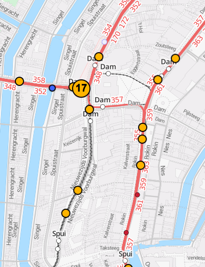

# OVapp
iOS app that displays the current, real-time locations of trams in Amsterdam

# Problem
When taking trams in Amsterdam I always run into the same problem; the trams don't arrive on the time they should.
This app will solve this problem by not displaying the departure time of the tram you want to take (which are never accurate), but rather show you the exact location of the tram, real-time.
Then you will know what tram is closest to you, and if you can take it slow or have to make a run for it!

# Features
User is able to see the current location of all trams or filter on:
* a specific tram
* a tram stop
* a destination tram stop (e.g. the user wants to go to Central Station, sees all trams that go there)

The locations will be displayed on a map. When user clicks on a tram location, the delay of the tram is displayed.

